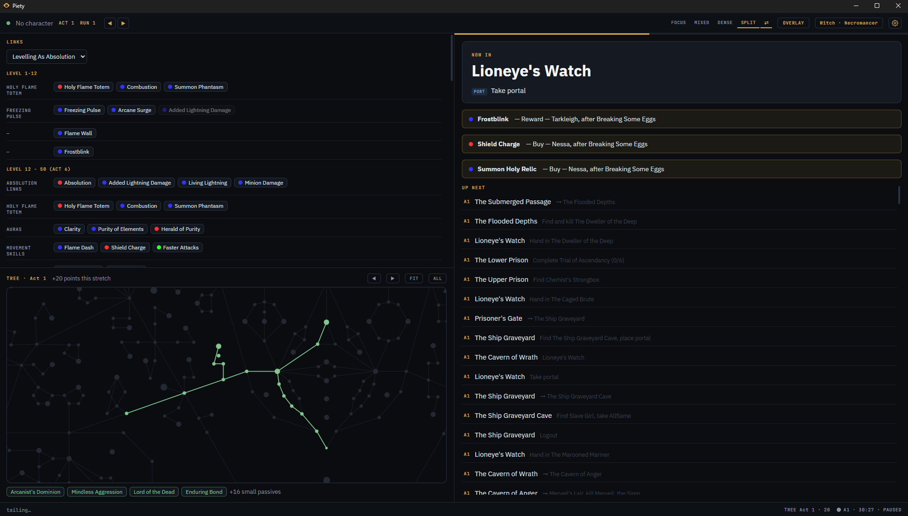
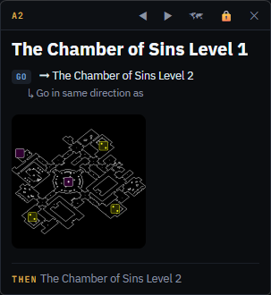

# Piety: a Path of Exile campaign leveling guide

Piety is a desktop companion for leveling through the Path of Exile campaign. It reads your `Client.txt` log to follow you zone by zone, shows the next steps from a proven leveling route, tells you which gems to buy and when, tracks your passive tree progression against your Path of Building specs, and times your act splits against your personal best.

The main window is built for a second monitor: a normal window you can snap wherever you want. For single monitor setups there is a compact overlay, a small always-on-top window that sits over the game without hooking into it.





## Features

- **Zone-by-zone route guide** based on the [exile-leveling](https://github.com/HeartofPhos/exile-leveling) routes for acts 1 to 10, with kill/quest/waypoint/portal steps and layout hints
- **Custom routes**: duplicate the built-in route and edit it in the app, with syntax highlighting, live validation, and import/export files for sharing
- **Zone layout maps** from Exile-UI shown beside the steps, labeled EXACT (one of the zone's known layouts, cycle to match your minimap) or SAMPLE
- **Automatic position tracking** by tailing `Client.txt`. Read only, no game files touched, no injection
- **Gem shopping list** built from your Path of Building import: what to buy, from which vendor, after which quest, for your class. Gems you get for free (starting gem, beach chest) are marked as granted
- **Passive tree progression** rendered on the real skill tree: what you should have allocated by now and where the next points go, based on the tree specs in your PoB build
- **Live Path of Building sync**: link a build from your local PoB saves and every save in PoB updates the app. Pasting an export code or a pobb.in link works too, and the app warns if your character's class doesn't match the build
- **Trial and lab tracking**: trials of Ascendancy check off automatically as you complete them, and once enough are banked a lab reminder banner sticks around until you dismiss it, so you can run lab at a natural stopping point
- **Pace timer** with per-act splits, per-zone splits, personal best comparison, best act segments (abandoned runs count, so act sprints are tracked too), a per-act death counter, run history, and a projected campaign finish. Starts automatically when you enter the Twilight Strand, stops at Karui Shores, and pauses while the game is closed. Click the footer timer chip to open the full pace panel
- **Per-character profiles**: route position, gem checklist, and trial progress are saved per character and switch automatically as you play
- **Four layouts** (glance, mixed, dense checklist, split with tree and gems) plus a compact band layout when the window is short, and a mirror option for left-side monitors
- **Overlay**: a small always-on-top window with the current zone, steps, layout map, and gem/lab reminders. Lockable so you cannot drag or resize it by accident
- **Auto updates** via GitHub releases

## Getting started

1. Download the latest `Piety-Setup-*.exe` from [Releases](https://github.com/sethryder/piety/releases) and run it. Windows SmartScreen may warn about an unknown publisher; the build is unsigned for now
2. The setup wizard walks you through it: locate `Client.txt` (usually found automatically, including Steam libraries on other drives), import your build from local PoB saves or a pasted code (or skip it for a guide-only setup), map your tree specs to act breakpoints, and pick league start or twink gear routing
3. Play. The guide follows you as you enter zones

If you use the overlay on top of the game, run PoE in Windowed Fullscreen. Exclusive fullscreen draws over everything.

### Linux

Download `Piety-*.AppImage` from Releases, make it executable (`chmod +x`), and run it. PoE installed through Steam/Proton is detected automatically, including libraries on other drives. If Path of Building runs under Wine or Lutris, builds in the default prefix are found too; set `POB_BUILDS_DIR` for custom prefixes. Known limitation: the overlay's always-on-top depends on your compositor, and some Wayland desktops ignore it (X11 is fine).

#### KDE Plasma: overlay hidden behind fullscreen games

On Plasma, KWin puts a focused fullscreen game above keep-above windows, so the overlay can disappear during play. Two steps fix it (thanks to [@jamesmeneghello](https://github.com/jamesmeneghello) in [#14](https://github.com/sethryder/piety/issues/14)):

1. On Wayland, launch Piety with `--ozone-platform=x11`. Native Wayland has no always-on-top protocol.
2. Add a KWin rule pinning the overlay window (titled `Piety Overlay`) to the overlay layer. Append this to `~/.config/kwinrulesrc` and run `qdbus org.kde.KWin /KWin reconfigure` (or log out and back in):

```ini
[piety-overlay]
Description=Piety overlay above fullscreen games
wmclass=piety
wmclassmatch=1
title=Piety Overlay
titlematch=1
layer=overlay
layerrule=2
types=1
```

## Development

```bash
npm install
npm run dev          # run locally (Electron + Vite + React)
npm test             # parser and logic tests
npm run package:win  # build the Windows installer into dist/ (package:linux for the AppImage)
npm run update-data  # refresh vendored routes, gem/quest data, and the passive tree
```

Game data is vendored, so the app works fully offline. `npm run update-data` refetches everything from upstream at league start, including the latest passive tree from GGG's official export. Run the tests afterwards; they parse the real data files and catch upstream format changes.

## Data sources and thanks

- Route and gem/quest data from [HeartofPhos/exile-leveling](https://github.com/HeartofPhos/exile-leveling) (MIT)
- Zone layout images from [Lailloken/Exile-UI](https://github.com/Lailloken/Exile-UI) (MIT)
- Passive tree data from [grindinggear/skilltree-export](https://github.com/grindinggear/skilltree-export)
- Build parsing for [Path of Building Community](https://github.com/PathOfBuildingCommunity/PathOfBuilding) exports

Full license texts for bundled third-party data are in [THIRD_PARTY_LICENSES](THIRD_PARTY_LICENSES).

## Disclaimer

Piety is a fan-made tool. It is not affiliated with or endorsed by Grinding Gear Games. It only reads the `Client.txt` log file, which is explicitly allowed for third party tools.
